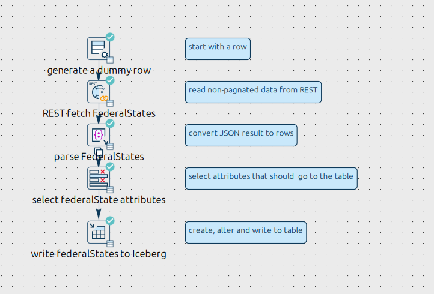
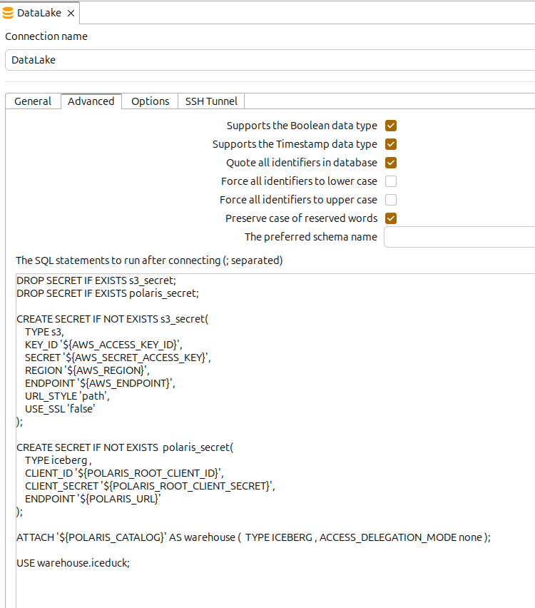
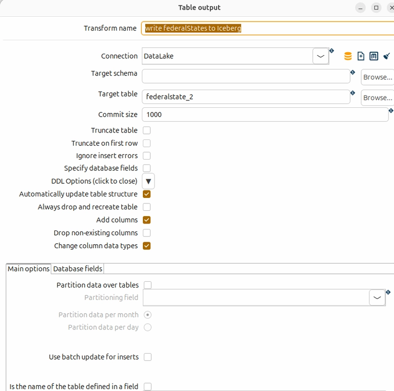

# Populate a Data Lakehouse with Apache Hop
## Introduction

With my [Iceduck](https://github/pfabricius/iceduck) project, I’ve been diving deep into Data Lakehouse architecture and the possibilities of the Modern Data Stack. Initially, I experimented with PySpark, PyIceberg, and similar tools in Jupyter Notebooks and via the Spark CLI. But I soon asked myself: How would this work with more traditional ETL tools and without Spark?

Around the same time, I read about [DuckDB’s](https://duckdb.org) Iceberg integration. A natural next step was to use the DuckDB JDBC driver to write to and read from the Data Lakehouse directly within an ETL tool. The JDBC driver creates an in-memory DuckDB instance, which communicates with the Data Lakehouse and its REST catalog via the DuckDB Iceberg extension. All that’s required is setting up two secrets in DuckDB and attaching the catalog, as outlined in the DuckDB documentation.

Beside DuckDB [Trino](https://trino.io) is a non-Spark option as Query Engine for Data Lakehouses. As there is a JDBC driver for Trino as well, this will be my second option to test.

[Apache Hop](https://hop.apache.org) is my first stop option when it needs a swiss army knife like tool for integration tasks.

## Apache Hop with DuckDB

For my DuckDB showcase, I wanted to rely entirely on open-source components. Here’s what I put together:

* Iceduck as a local Data Lakehouse platform, using Apache Polaris as the catalog
* Apache Hop as a Java-based data integration tool
* DuckDB JDBC Treiber as the bridge between ETL and the Data Lakehouse. It is already contained in the Apache Hop package
* OpenPLZApi as a sample data source

I won’t cover the installation of Iceduck or Hop here, as their respective project pages provide detailed instructions.

Apache Hop is a low-code data integration tool with a graphical interface. A pipeline that pulls JSON data from a REST API, processes it, and writes it to a target table looks like this:

:

This pipeline would look identical if you were writing the data to a relational database—except instead of a DuckDB connection, you’d use a Postgres, MariaDB, Oracle, or similar connection. Behind the scenes, however, things work differently: the DuckDB driver itself acts as the database during pipeline execution.

In this database, a connection initialization script stored in the metadata creates the Data Lakehouse credentials as secrets, attaches the Iceberg catalog, and maps the database schema to the Data Lakehouse. This allows DuckDB to interact directly with the Data Lakehouse, enabling table and content manipulation.

:

The actual data writing happens in the final step of the pipeline: the "write federalStates to Iceberg" transform, which is a "Table Output" step.

:

### Key Learnings
While this approach works surprisingly well, there are a few lessons I’ve learned along the way:

* Writing to two Iceberg tables in parallel within a single pipeline fails. It seems there are issues with the catalog in this scenario.
* Each dataset results in a new Parquet file being written.

## Conclusion

This experiment showed that integrating a Data Lakehouse with traditional ETL tools like Apache Hop is not only possible but also straightforward—thanks to DuckDB’s flexibility and the power of open-source components. While there are some limitations, the approach opens up new possibilities for data engineers looking to modernize their stacks without abandoning familiar tools.
